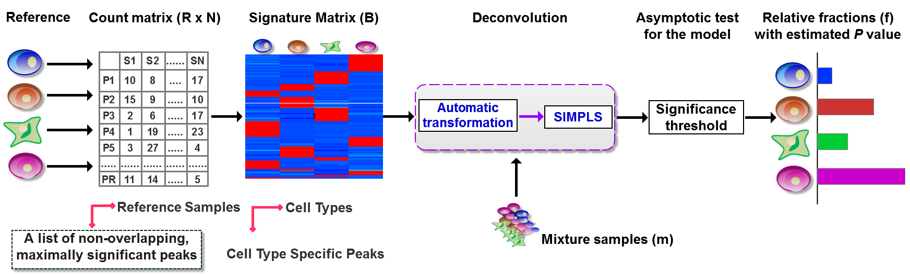

DeconPeaker
===================================================

`DeconPeaker`: a deconvolution method to estimate cell type proportions in chromatin accessibility data (ATAC-Seq) and as well as gene expression data (RNA-Seq & Microarray).

How to use `DeconPeaker`?
---------------------
DeconPeaker's code is a mix of Python2.7 and R(3.5), which requires the following dependencies.
* Python2.7:
	* Numpy
	* Scipy
	* Pandas
	* bx
	* Matplotlib
	* rpy2 (older version)
* R3.5:
	* pls
	* transport
	* colorRamps
* Other tools (when excute preprocess and simulation steps):
	* bedtools
	* samtools
	* featureCounts

-------------------
It is necessary to mention that there are four parts in DeconPeaker, and details as follows:
* preprocess: only support on Linux system
* findctsps: support on Windows and Linux systems
* deconvolution: support on Windows and Linux systems
* simulation: only support on Linux system

More Information
--------------------
Please see [Tutorial](https://lihuamei.github.io//DeconPeaker/test/DeconPeak_demo.html).
