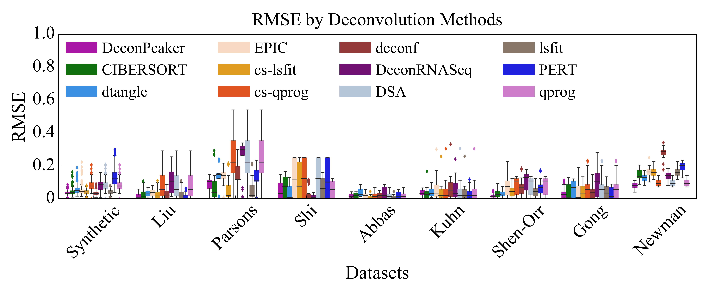

DeconPeaker
===================================================

`DeconPeaker`: a deconvolution method to estimate cell type proportions in chromatin accessibility data (ATAC-Seq) and as well as gene expression data (RNA-Seq & Microarray).

-------------------------
How to use `DeconPeaker`
